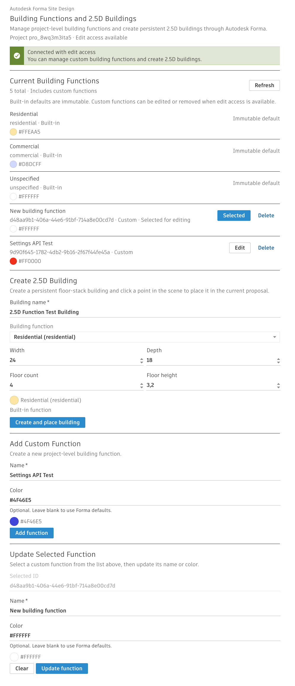

# Forma Building Functions + 2.5D Buildings

This repository contains an Autodesk Forma Site Design embedded-view extension for:

- managing project-level building functions through `Forma.settings`
- creating persistent 2.5D floor-stack buildings through `Forma.elements.floorStack`
- placing created buildings in the active proposal through `Forma.proposal`



## Features

- Load the current project's building functions.
- Add custom building functions with an optional color.
- Update custom building function names and colors.
- Delete custom building functions.
- Create a 2.5D building, assign it a selected building function, and place it in the scene.
- Render safely outside Forma in preview mode with host-only actions disabled.

## Tech Stack

- React
- TypeScript
- Vite
- `forma-embedded-view-sdk`
- Weave UI Kit via `@weave-mui/material` and `@weave-mui/styles`

## Local Development

Install dependencies:

```bash
npm install
```

Start the development server:

```bash
npm run dev
```

Create a production build:

```bash
npm run build
```

Run lint checks:

```bash
npm run lint
```

## Using The Extension

### In Autodesk Forma

1. Open the extension inside Autodesk Forma.
2. Review or manage building functions in the current project.
3. Select a building function in the 2.5D building form.
4. Enter the building dimensions and floor data.
5. Click `Create and place building`, then click a point in the scene.

### In Local Preview

When opened outside Forma, the UI renders in preview mode. Host-only functionality such as settings mutations and scene placement stays disabled until the extension is opened from the Autodesk Forma embedded-view host.
